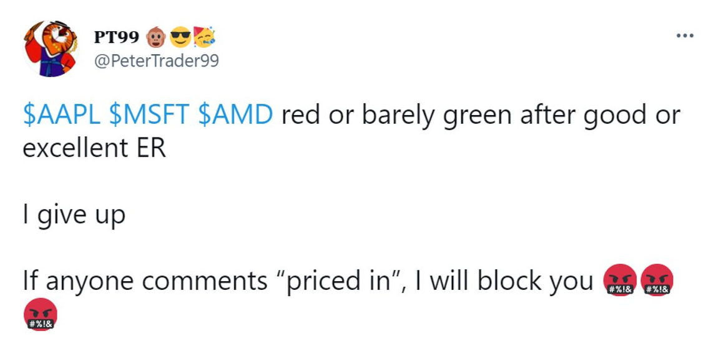
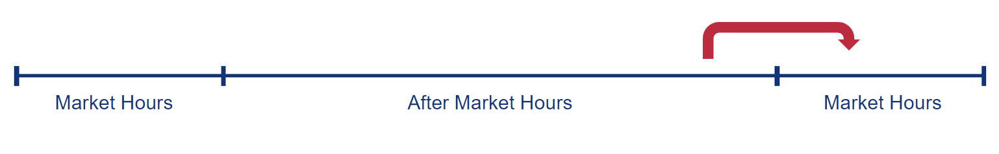
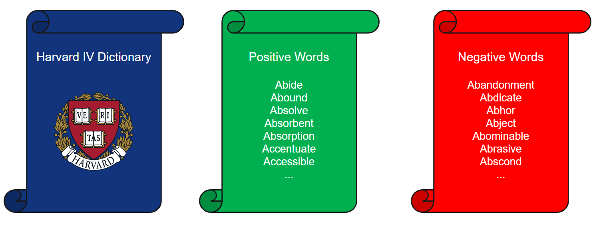
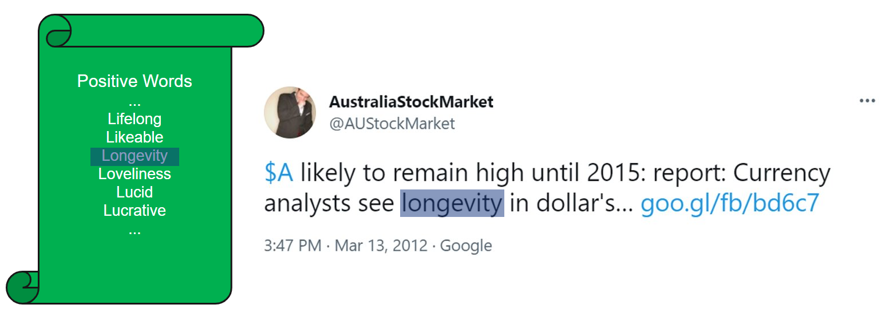
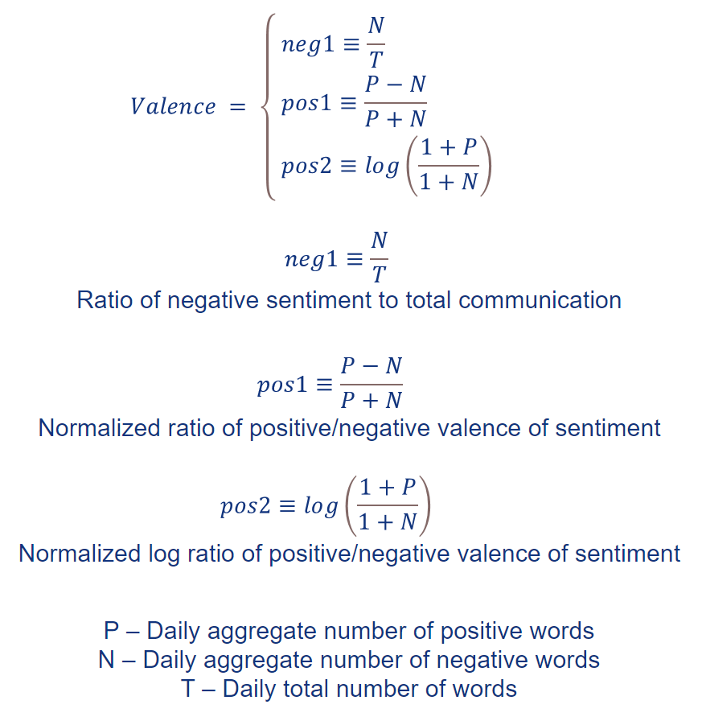
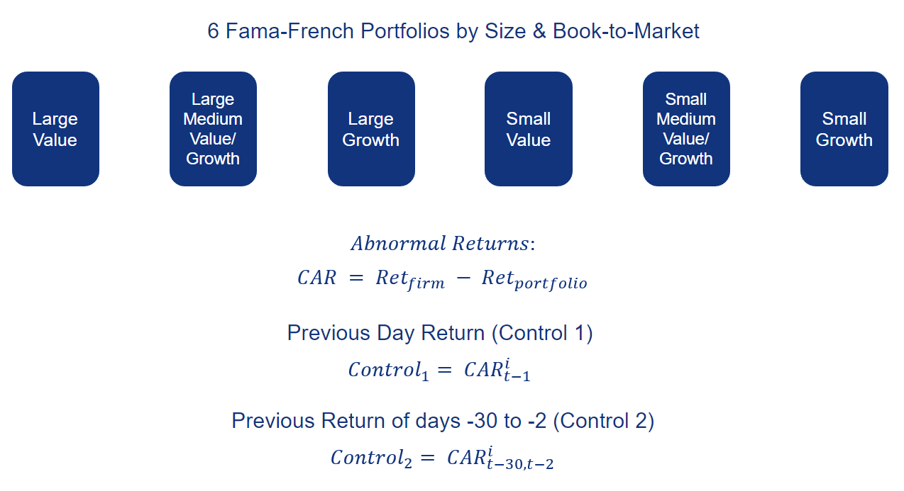
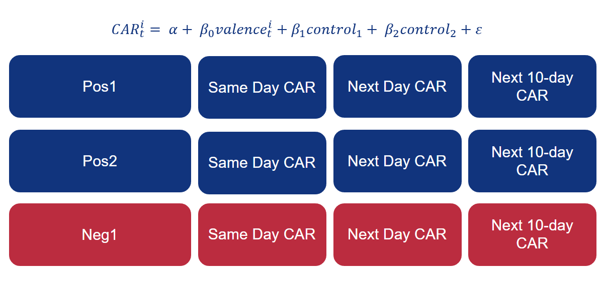
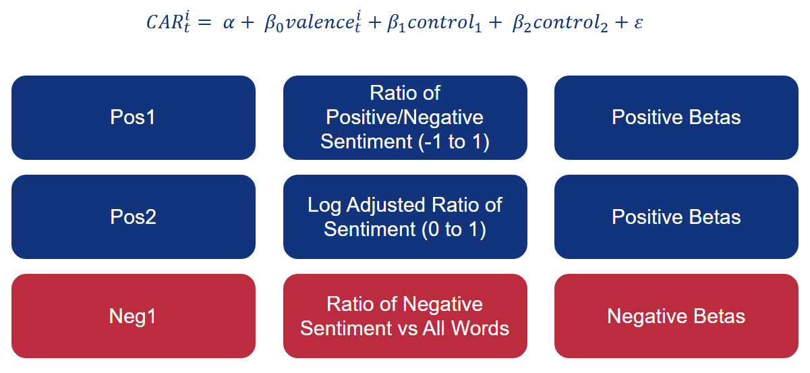
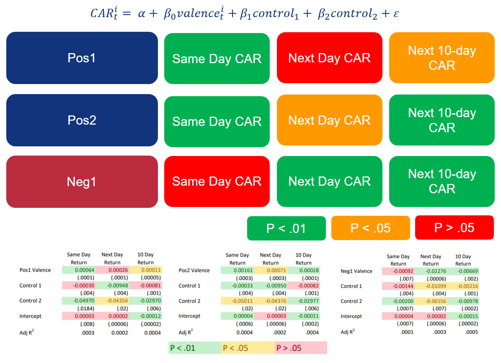

# Does the sentiment (emotional valence) of twitter post correlate to short term stock returns?

After the explosion of retail investers in 2020, I was curious to see if social media was driving decision and therefore stock prices. 

## Twitter mood predicts the stock market (Bollen, Mao, and Zeng 2011). 

This paper looks at general tweets and groups them by mood (using a dictionary of words). There were able to find a coorelation between stock returns from the DJIA and the number of calm tweets. This seems to make sense since the market typically reacts negatively to uncertainty, so during periods of calmness the market would have higher expected returns.

## Trading on Twitter: The financial Information Content of Emotion in Social Media (Sul, Dennis, and Yuan 2014)

This paper expanded on previous work by by Boolen, Mao and Zeng. Instead of focusing on the general mood of the twitter population (all tweets) they wanted to see how tweets made about individual firms effected the returns of those firms over the short term. Using a dictionary of positive and negative words they were able to find a coorelation between positive sentiment and same day returns, as well as 10 day returns. They were also able to find a negative coorelation between negative sentiment and same day returns, as well as 10 day returns. 

To replicate the results found in this paper I had to create two programs. One that would scrape twitter for the data during the same time frame (Mar 2011- Feb 2012) and another program that would analyze the data using the methods described. 

## Scraping twitter data **requires twitter academic API access**

Scrapping twitter data was acomplished using twitter-scrape.py. It works by querrying the twitter API for tweets that contain the '$' sign followed by a ticker. This was done for all firms within the S&P 500. 

# Analyizing the twitter data

# Data Collection

Data was collected from:

* Twitter API
* Fama French
* CRSP
* Compustat

# Cleaning the data

We must do some data validation before we can begin our analysis. 

###  Remove duplicate entries

###  Remove entries with multiple tickers

It is important that we remove tweets that contain multiple tickers within the body, since it would be difficult to assign the sentiment of the tweet to a specific firm. 

## Assign tweets to their respective trading days

     
Tweets made after market hours are assigned to the next trading day, since the sentiment would effect returns for the next trading day. Tweets made on Saturday and Sunday were assigned to Monday. 

# Calculate the sentiment

Sentiment was calculated using a dictionary of positive and negative sentiment words from the Harvard-IV Dictionary. 

The number of positive and negative words were counted per tweet.

These counts were then aggregated on a per day and per firm basis. This would give us the number of positive words per day per firm and the number of negative words per day per firm. 

## Emotional Valence Variables

We then calculate the emotional valence variables that will be used in the regressions. 

### Control Variables

If sentiment is driving the return of a firm then we would expect it to be outpreforming similar firms. Using the 6 Fama French portfolios by size & book-to-market we can determine the 'abnormal return' (CAR) or the difference in the return of the firm versus a portfolio of firms with similar size and book-to-market values. 

We control for momentum with the Control 1 (previous day returns) and Control 2 variables (previous month returns not including the previos day returns). 

# Apply regression models

The above regression will be preformed 9 times. For each variable (Pos1, Pos2, Neg1) and for each time serries (same day, next day and next 10-day). 

## Regression Expectations if our hypothesis is correct

     
## Regression Results

     
For each of the 9 regresions we have the expected sign for Beta. We have strong statistical significance in 5/9 of the regressions (P < .01), acceptable statistical significance in 2/9 of the regressions (P < .05) and no statistical significance (P > .05) in 2/9 of the regressions. 

